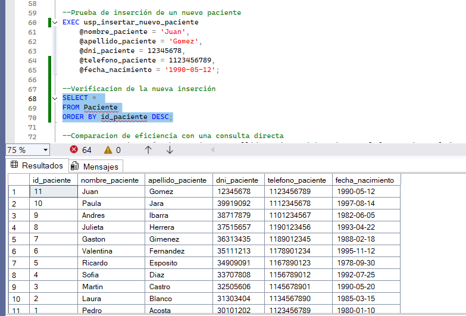
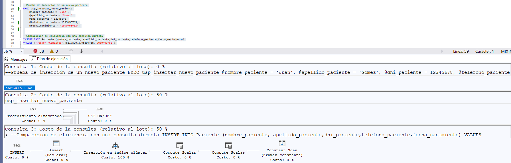
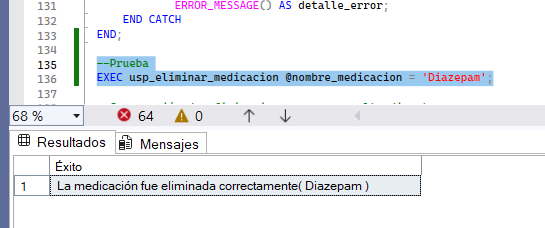
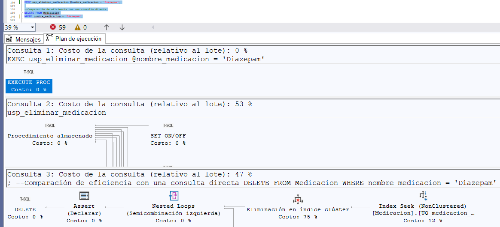
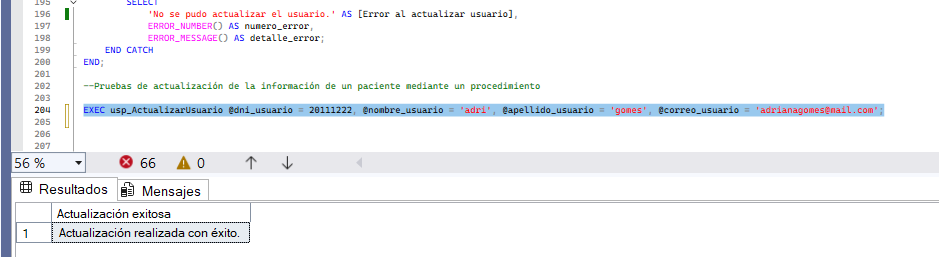
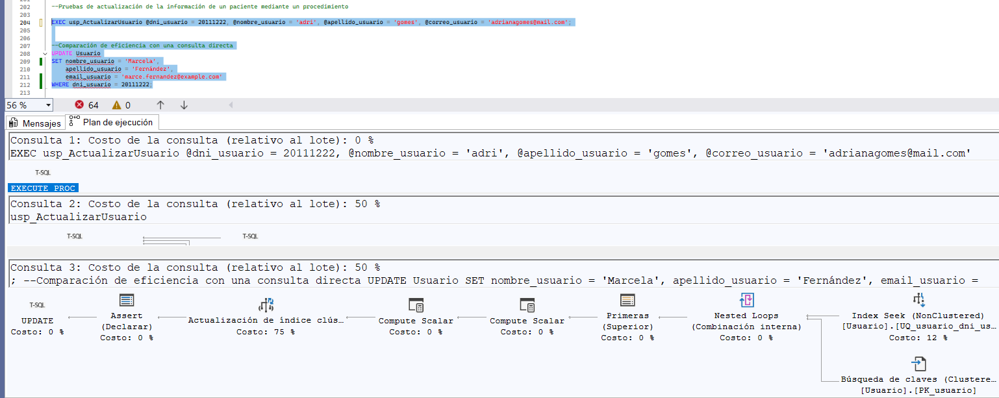
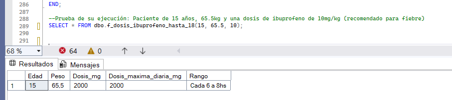
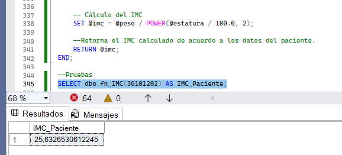
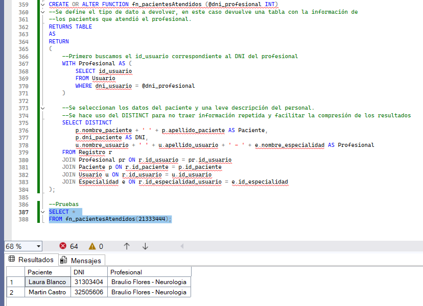

# Conclusión de los resultados del experimento de los procedimientos y funciones almacenadas.

---

## Primer procedimiento: inserción de un nuevo paciente

```SQL
--PROCEDIMIENTO INSERT EN LA TABLA PACIENTE
--Basicamente este procedimiento registra a un nuevo paciente en nuestra clínica.
--Se crea el procedimiento junto con su nombre. Las siglas "usp" son una convención común para hacer referencia a que es un
--procedimiento almacenado creado por  un usuario y asi poder diferenciarlo del resto (user store procedure).
CREATE PROCEDURE usp_insertar_nuevo_paciente
(
	--Se definen los parámetros de entrada que esperará el procedimiento, asi como su tipo de dato y tamaño
    @nombre_paciente      VARCHAR(100),
    @apellido_paciente    VARCHAR(100),
    @dni_paciente         INT,
    @telefono_paciente    INT,
    @fecha_nacimiento     DATE
)
AS
BEGIN
	--Con esta sentencia se evita que al insertar un nuevo paciente aparezca el mensaje de "(1 row(s) affected)", volviendo 
	--este procedimiento de inserción más amigable al momento de mostrar los datos.
    SET NOCOUNT ON;

	--Se comienza con la inserción de los datos del paciente en la tabla, primero especificando las columnas que van a ser
	--utilizadas y los parámetros que reciben valores, los cuales van a ser asignados a cada una de las columnas de la tabla.
	--También se hace uso de un TRY-CATCH para manejar posibles errores y evitar que la ejecución de los procedimientos falle.
    BEGIN TRY
        
		--Inserción en la tabla
        INSERT INTO Paciente
        (
            nombre_paciente,
            apellido_paciente,
            dni_paciente,
            telefono_paciente,
            fecha_nacimiento
        )

		--Los valores a ser insertados
        VALUES
        (
            @nombre_paciente,
            @apellido_paciente,
            @dni_paciente,
            @telefono_paciente,
            @fecha_nacimiento
        );

		--Mensaje que indica que el paciente fue ingresado correctamente.
        PRINT 'Paciente insertado correctamente.';

    END TRY
    BEGIN CATCH
		--Manejo de los errores en caso de que no se haya podido insertar correctamente a un paciente.
        PRINT 'Error al insertar el paciente: ' + ERROR_MESSAGE();
    END CATCH
END;

--Prueba de inserción de un nuevo paciente
EXEC usp_insertar_nuevo_paciente
    @nombre_paciente = 'Juan',
    @apellido_paciente = 'Gomez',
    @dni_paciente = 12345678,
    @telefono_paciente = 1123456789,
    @fecha_nacimiento = '1990-05-12';

--Verificacion de la nueva inserción
SELECT * 
FROM Paciente
ORDER BY id_paciente DESC;
```



En cuanto a la eficiencia, se puede ver cómo que ambas ejecuciones presentan una eficiencia del 50%, por lo que la conclusión que puedo sacar es que, de acuerdo a los datos de nuestro procedimiento y la sentencia directa del INSERT, ninguna es más eficiente que la otra.




---

## Segundo procedimiento: eliminación de una medicación

```SQL
--PROCEDIMIENTO DELETE DE UN MEDICAMENTO DE LA TABLA MEDICACION (siempre y cuando no esté asociada a un registro)
--Basicamente este procedimiento elimina un medicamento de la tabla de medicacion
--pensando en que por ejemplo, se descubra que el mismo ya no debe ser 
--comercializado ni recetado.
DROP PROCEDURE usp_eliminar_medicacion
--Primero se crea el procedimiento
CREATE PROCEDURE usp_eliminar_medicacion
    @nombre_medicacion VARCHAR(200)--Se define el parámetro que va a recibir, en este caso la medicación a eliminar
    --Si bien tambien se podría manejar por ID, es mejor usar el nombre del medicamento por si no se conoce el ID
    --del mismo. De igual manera, también tomamos esta decisión porque en nuestra tabla el nombre de las medicaciones
    --es único.
AS
BEGIN
	--Con esta sentencia se evita que al insertar un nuevo paciente aparezca el mensaje de "(1 row(s) affected)", volviendo 
	--este procedimiento de inserción más amigable al momento de mostrar los datos.
    SET NOCOUNT ON;

    --Se comienza con el procedimiento de la eliminación de la medicación de la tabla.
    --Se hace uso de las sentencias TRY-CATCH para manejar los posibles errores que puedan surgir
    BEGIN TRY
        
        --Primero se verifica que exista la medicación en nuestra base de datos.
        IF NOT EXISTS (SELECT 1 
                       FROM Medicacion 
                       WHERE nombre_medicacion = @nombre_medicacion)
        BEGIN
        --Mensaje en caso de que la medicación no exista, por ende no se puede eliminar.
            SELECT 'La medicación indicada no existe.' AS mensaje;
            RETURN;
        END;

        --Se busca eliminar de la tabla la medicación pasada por parámetro.
        DELETE FROM Medicacion
        WHERE nombre_medicacion = @nombre_medicacion;

        --Mensaje de éxito en caso de que la medicación se haya eliminado correctamente de la tabla.
        SELECT 'La medicación fue eliminada correctamente' + '( ' + @nombre_medicacion + ' )' AS Éxito;
    
    --Finaliza el TRY-CATCH de este primer bloque
    END TRY

    --En caso de que la medicación esté asociada a un registro, se evita su eliminación para no dejar registros
    --sin medicaciones, lo cual podría causar grandes problemas en el seguimiento clínico de un paciente.
    BEGIN CATCH
        SELECT 
            'No se pudo eliminar la medicación. Posiblemente esté asociada a otros registros.' AS Error,
            ERROR_NUMBER() AS numero_error,
            ERROR_MESSAGE() AS detalle_error;
    END CATCH
END;

--Prueba
EXEC usp_eliminar_medicacion @nombre_medicacion = 'Diazepam';
```



En cuanto a la eficiencia, se puede ver que la eliminación directa es un 6% más eficaz que el procedimiento almacenado, por lo que en este caso en particular sería la mejor opción, realizar eliminaciones mediante la sentencia directa DELETE en lugar de utilizar un procedimiento, aunque al ser la diferencia de eficiencia tan baja, no sería equivocado, en nuestro caso y con nuestros datos, utilizar el procedimiento.



--- 

## Tercer procedimiento: actualización de la información de un usuario

```SQL
--PROCEDIMIENTO UPDATE DE LA TABLA USUARIOS
--Basicamente este procedimiento actualiza la información de un usuario
--pensando en que por ejemplo, se hayan ingresado mal los datos del mismo
--o se quiera modificar el correo electrónico, contraseña,etc.
--Está pensado que no se pueda modificar el DNI ya que es su PK

--Primero se crea el procedimiento
CREATE PROCEDURE usp_ActualizarUsuario
(
--Se definen los parámetros de entrada que se busca que reciba el procedimiento para su posterior uso
    @dni_usuario INT,                          
    @nombre_usuario VARCHAR(200) = NULL,
    @apellido_usuario VARCHAR(200) = NULL,
    @correo_usuario VARCHAR(200) = NULL,
    @password VARCHAR(200) = NULL
)
AS
BEGIN
--Con esta sentencia se evita que al insertar un nuevo paciente aparezca el mensaje de "(1 row(s) affected)", volviendo 
--este procedimiento de inserción más amigable al momento de mostrar los datos.
    SET NOCOUNT ON;

    --Comienza el bloque que actualiza la información del usuario
    --Se hace uso de una sentencia TRY-CATCH para manejar posibles errores durante la ejecución
    BEGIN TRY
        UPDATE Usuario
        SET 
        --Se hace uso de la función "COALESCE" la cual al devuelve el primero que no sea NULL, es decir que
        --si se pasa un nuevo nombre por parámetro, este campo se actualiza, en cambio, si no se pasa ningún valor
        --es decir que ese campo es NULL, se mantiene el valor de la tabla. Esto funciona para cada uno de las
        --columnas a actualizar
            nombre_usuario = COALESCE(@nombre_usuario, nombre_usuario),
            apellido_usuario = COALESCE(@apellido_usuario, apellido_usuario),
            email_usuario = COALESCE(@correo_usuario, email_usuario),
            password = COALESCE(@password, password)

        --Se filtra por el DNI del usuario a modificar
        WHERE dni_usuario = @dni_usuario;
        
        --Se muestra un mensaje de éxito al actualizar la información del paciente.
        SELECT 'Actualización realizada con éxito.' AS [Actualización exitosa];

    END TRY

    --Se maneja con otra sentencia TRY-CATCH en caso de que no se haya podido realizar la actualización
    --de la información del usuario
    BEGIN CATCH
        SELECT 
            'No se pudo actualizar el usuario.' AS [Error al actualizar usuario],
            ERROR_NUMBER() AS numero_error,
            ERROR_MESSAGE() AS detalle_error;
    END CATCH
END;

--Pruebas de actualización de la información de un paciente mediante un procedimiento

EXEC usp_ActualizarUsuario @dni_usuario = 20111222, @nombre_usuario = 'adri', @apellido_usuario = 'gomes', @correo_usuario = 'adrianagomes@mail.com';

```



En cuanto a la eficiencia, se puede ver cómo que ambas ejecuciones presentan una eficiencia del 50%, por lo que la conclusión que puedo sacar es que, de acuerdo a los datos de nuestro procedimiento y la sentencia directa del UPDATE, ninguna es más eficiente que la otra. En este caso, sería arbitrario el uso de alguna de ellas.

imagen eficiencia update



---

### También, para una mayor comprensión del tema se crearon 3 funciones adaptadas a nuestro proyecto, las cuales podrían ser de suma utilidad en una clínica.

## Función 1: Función que calcula la dosis de ibuprofeno de acuerdo al peso y la edad del paciente.

```SQL
--FUNCIÓN 1
--Función que calcula la dosis de ibuprofeno de acuerdo al peso y la edad del paciente.
--Se busca que devuelva varias columnas (edad, peso, dosis, dosis máxima y rango recomendable).

CREATE FUNCTION dbo.f_dosis_ibuprofeno_hasta_18
(
    --Parámetros de entrada: edad del paciente, su peso en kg, 
    --y la dosis en mg/kg según el medicamento.
    @edad INT,
    @peso FLOAT,
    @dosis_mg_kg FLOAT
)
--Se devuelven los resultados en formato de una tabla "temporal" cuya existencia radica solo
--durante la ejecución de la función.
RETURNS @Resultados TABLE
(
--Se definen los datos que se van a mostrar, junto con su tipo de dato
    Edad INT,
    Peso FLOAT,
    Dosis_mg FLOAT,
    Dosis_maxima_diaria_mg FLOAT,
    Rango VARCHAR(20)
)
AS
BEGIN
    --Declaración de variables locales internas de la función
    DECLARE @dosis FLOAT; --La dosis del medicamento
    DECLARE @dosis_max FLOAT; --Dosis máxima diaria permitida
    DECLARE @rango_dosis VARCHAR(20); --Rango de tiempo recomendado

    --Se calcula la dosis estimada según el peso y los mg/kg
    SET @dosis = @peso * @dosis_mg_kg;

    --Rango horario recomendado por defecto
    SET @rango_dosis = 'Cada 6 a 8hs';

    --Estructura condicional utilizada para definir la dosis máxima del medicamento
    --de acuerdo a la edad y el peso de los pacientes para evitar que se recomienden dosis
    --que puedan generar intoxicaciones en los pacientes.
    IF @edad >= 3 AND @edad < 18 AND @peso > 10 AND @peso < 40
    BEGIN
        SET @dosis_max = 400;
        SET @dosis = @dosis_max;
    END
    ELSE 
    BEGIN
        IF @edad < 105 AND @peso < 160
        BEGIN
            SET @dosis_max = 2000;
            SET @dosis = @dosis_max;
        END
    END

    --Inserción de los valores a devolver por la función
    INSERT INTO @Resultados
    VALUES
    (
        @edad,
        @peso,
        @dosis,
        @dosis_max,
        @rango_dosis
    );

    RETURN;
END;

--Prueba de su ejecución: Paciente de 15 años, 65.5kg y una dosis de ibuprofeno de 10mg/kg (recomendado para fiebre)
SELECT *  FROM dbo.f_dosis_ibuprofeno_hasta_18(15, 65.5, 10);

```



---

## Función 2: Función que calcula el índice de masa corporal (IMC) del paciente, pasando su DNI como parámetro.

```SQL
--FUNCION 2
--Funcion que calcula el índice de masa corporal (IMC) del paciente, pasando su DNI como parámetro para
--la obtención de sus datos médicos de su ficha médica.

--Primero se crea la función, el parámetro a recibir y su tipo de dato
CREATE FUNCTION dbo.fn_IMC(@dni_paciente INT)
--Se especifica el valor a devolver
RETURNS FLOAT
AS
--Comienza el bloque de instrucciones propias de la función
BEGIN
    --Se declaran las variables locales a utilizar, junto con el tipo de dato de cada una
    DECLARE @peso FLOAT;
    DECLARE @estatura INT;
    DECLARE @imc FLOAT;
    DECLARE @id_paciente INT;

    -- Primero obtenemos el id_paciente a partir del dni (porque la ficha está ligada por id_paciente)
    SELECT TOP (1) @id_paciente = p.id_paciente
    FROM dbo.Paciente AS p
    WHERE p.dni_paciente = @dni_paciente;

    -- Si no existe paciente con ese DNI devolvemos NULL
    IF @id_paciente IS NULL
    BEGIN
        RETURN NULL;
    END

    -- Obtenemos el peso y estatura desde la ficha médica del paciente (última ficha por fecha)
    SELECT TOP (1)
        @peso = f.peso,
        @estatura = f.estatura
    FROM dbo.Ficha_medica AS f
    WHERE f.id_paciente = @id_paciente
    ORDER BY f.fecha_creacion DESC;--aca se toma la ficha mas reciente

    -- Si no existe ficha médica, devolvemos NULL. Es decir que solo se puede calcular el IMC en pacientes con un registro
    IF @peso IS NULL OR @estatura IS NULL OR @estatura = 0
    BEGIN
        RETURN NULL;
    END

    -- Cálculo del IMC
    SET @imc = @peso / POWER(@estatura / 100.0, 2);

    --Retorna el IMC calculado de acuerdo a los datos del paciente.
    RETURN @imc;
END;

--Pruebas
SELECT dbo.fn_IMC(30101202) AS IMC_Paciente;


```





---

## Función 3: Función que muestra los pacientes atendidos por un profesional de la salud (médico o enfermero).

```SQL
--FUNCION 3
--Funcion que muestra los pacientes atendidos por un profesional de la salud (médico o enfermero),
--junto con la información del paciente y una leve descripción del profesional.

--Primero se crea la función, el paráetro de entrada que espera recibir y su tipo de dato. En
--este caso es el DNI del profesional.
--La función filtra los registros donde el DNI del profesional aparezca, es deicr, los registros/estudios
--que haya realizado a detereminados pacientes.
CREATE OR ALTER FUNCTION fn_pacientesAtendidos (@dni_profesional INT)
--Se define el tipo de dato a devolver, en este caso devuelve una tabla con la información de 
--los pacientes que atendió el profesional.
RETURNS TABLE
AS
RETURN
(
    --Primero buscamos el id_usuario correspondiente al DNI del profesional
    WITH Profesional AS (
        SELECT id_usuario
        FROM Usuario
        WHERE dni_usuario = @dni_profesional
    )

    --Se seleccionan los datos del paciente y una leve descripción del personal.
    --Se hace uso del DISTINCT para no traer información repetida y facilitar la compresión de los resultados
    SELECT DISTINCT
        p.nombre_paciente + ' ' + p.apellido_paciente AS Paciente,
        p.dni_paciente AS DNI,
        u.nombre_usuario + ' ' + u.apellido_usuario + ' - ' + e.nombre_especialidad AS Profesional
    FROM Registro r
    JOIN Profesional pr ON r.id_usuario = pr.id_usuario
    JOIN Paciente p ON r.id_paciente = p.id_paciente
    JOIN Usuario u ON r.id_usuario = u.id_usuario
    JOIN Especialidad e ON r.id_especialidad_usuario = e.id_especialidad
);

--Pruebas
SELECT * 
FROM fn_pacientesAtendidos(21333444);

```




---
