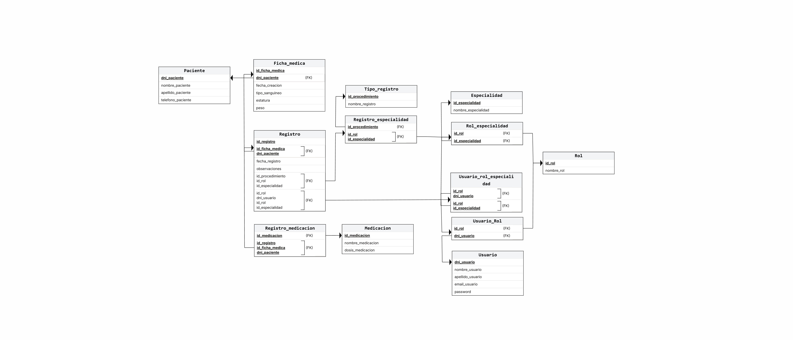

---

<h3 align="center">UNIVERSIDAD NACIONAL DEL NORDESTE</h3>
<h4 align="center">Facultad de Ciencias Exactas y Naturales y Agrimensura</h4>

---

### Proyecto: Clinicks - Sistema de Gestión de Pacientes

#### Alumnos:
- San Lorenzo Díaz, Juan Cruz - DNI N°: 46.316.672  
- Solis, Agustina - DNI N°: 46.380.532  
- Villarreal, Tomás Agustín - DNI N°: 46.147.515  
- Zimerman, Benjamín - DNI N°: 43.064.294  

#### Equipo Docente:
- Lic. Darío O. Villegas  
- Lic. Walter O. Vallejos  
- Exp. Juan José Cuzziol  
- Lic. Numa Badaracco  

**Carrera:** Licenciatura en Sistemas de Información  
**Cátedra:** Bases de Datos I  
**Año:** 2025  

---
# Índice de contenido

- [Capítulo I: Introducción](#capitulo-i-introduccion)
- [Capítulo II: Marco Conceptual o Referencial](#capitulo-ii-marco-conceptual-o-referencial)
- [Capítulo III: Metodología Aplicada](#capitulo-iii-metodologia-aplicada)
- [Capítulo IV: Desarrollo del Proyecto/Presentación de Resultados](#capitulo-iv-desarrollo-del-proyecto-presentacion-de-resultados)
- [Capítulo V: Conclusiones](#capitulo-v-conclusiones)
- [Capítulo VI: Link y referencias](#capitulo-vi-link-y-referencias)

---
<a id="capitulo-i-introduccion"></a>
## Capítulo I: Introducción

<p style="text-align: justify;">
El presente trabajo tiene como tema central el diseño y desarrollo de un sistema de gestión de pacientes para una clínica, orientado a reemplazar y optimizar el uso de registros en formato papel. El proyecto se enfoca en la creación de una base de datos que permita almacenar de manera segura, organizada y accesible la información de los pacientes, su historial médico y otros datos relevantes para la atención en la institución. Asimismo, el sistema contempla la administración de información relacionada con el personal de la clínica, incluyendo doctores, enfermeros, administrativos y otros usuarios que interactúen con la plataforma.


En la actualidad, muchas instituciones médicas continúan utilizando registros en papel para la gestión de pacientes y la organización de sus procesos internos. Este método, además de demandar mayor tiempo en la búsqueda y actualización de información, presenta riesgos de pérdida de datos, deterioro físico de los registros, duplicación de información y dificultades en la comunicación entre áreas.
Como grupo ante esta situación, identificamos la necesidad de desarrollar una solución tecnológica que permita centralizar y digitalizar la información de la clínica, garantizando un acceso más rápido, seguro y eficiente a los datos. Las preguntas principales a las que busca dar respuesta nuestro trabajo son las siguientes:

- ¿Cómo reemplazar el uso del papel en la gestión de pacientes de una clínica mediante la implementación de un sistema digital basado en bases de datos?  
- ¿De qué manera organizar la información de los pacientes, sus historiales médicos y los datos del personal de salud de manera clara, segura y escalable?  
- ¿Qué beneficios trae la digitalización en términos de eficiencia administrativa y calidad en la atención al paciente?  

Este análisis realizado nos da una idea de la magnitud e importancia del proyecto a realizar, ya que busca brindar una solución moderna y adaptable a una problemática real en el ámbito de la salud, que mejoraría la experiencia de atención por parte de los pacientes y reduciría los costos de trabajo para los profesionales a cargo.
Nuestro objetivo principal es diseñar y modelar una base de datos para un sistema de gestión de pacientes de una clínica, que permita organizar y administrar la información de los pacientes y del personal de la institución, reemplazando el uso de registros en papel por una solución digital más eficiente y segura.

En cuanto a los objetivos más específicos consideramos:

- Analizar los procesos actuales de gestión de pacientes en clínicas que utilizan registros en papel.
- Definir los principales requerimientos funcionales de la base de datos, considerando pacientes, historiales médicos, personal médico y administrativo.
- Diseñar un modelo conceptual de la base de datos que represente de manera adecuada la realidad de la clínica.
- Implementar el modelo lógico de la base de datos, estableciendo las relaciones necesarias entre las entidades.
- Evaluar la utilidad del sistema propuesto en términos de accesibilidad, seguridad y reducción de errores en la gestión de información.
</p>


---

<a id="capitulo-ii-marco-conceptual-o-referencial"></a>
## Capítulo II: Marco Conceptual o Referencial

<p style="text-align: justify;">
En este capítulo se busca contextualizar el trabajo dentro de un conjunto de conceptos teóricos y referenciales que permiten comprender mejor el problema abordado y fundamentar la solución propuesta. De esta manera, se establecen las bases conceptuales relacionadas con las tecnologías de la información y comunicación, la gestión de datos en entornos de salud, la digitalización de procesos administrativos y clínicos, y el papel de las bases de datos en la modernización de instituciones médicas.


Para comenzar hablamos de las Tecnologías de la Información y la Comunicación (TICs), que han transformado la forma en que las organizaciones administran sus recursos, procesan datos y brindan servicios. En el ámbito de la salud, estas tecnologías resultan esenciales para garantizar el almacenamiento seguro de información sensible, la accesibilidad en tiempo real de historiales médicos y la mejora en la coordinación de la atención de los pacientes. La innovación tecnológica aplicada a la salud permite no solo reducir costos operativos, sino también optimizar la calidad de los servicios prestados.


Por otro lado, la globalización ha impulsado una creciente necesidad de estandarizar procesos y mejorar la eficiencia en la administración de información. En el sector sanitario, la gestión de datos se ha convertido en un factor clave para garantizar la continuidad de la atención, evitar duplicaciones de estudios médicos y ofrecer un servicio más integral. La existencia de sistemas digitales para la gestión de pacientes permite a las clínicas adaptarse a un contexto donde la inmediatez y la precisión de la información constituyen ventajas competitivas.


Debido a la transición del uso de registros en papel a sistemas informatizados, se pudo evidenciar como los tiempos de búsqueda de información se redujeron considerablemente, así también como se redujo la tasa de errores humanos en la carga de datos y se constató mejoras en cuanto a la trazabilidad de los historiales médicos. Además, favorece la interoperabilidad entre distintas áreas de la institución, como administración, consultorios médicos y enfermería, lo cual se traduce en un servicio más eficiente y confiable.


Como una solución moderna y basándonos en antecedentes reales que obtuvieron un gran éxito en nuestro país planteamos el uso de una base de datos. Una base de datos es un conjunto organizado de información que puede ser gestionado, actualizado y consultado mediante un sistema gestor. En el caso de una clínica, la base de datos constituye el núcleo de un sistema de gestión de pacientes, ya que permite centralizar toda la información relacionada con la atención médica y el personal de la institución. El diseño adecuado de un modelo de datos garantiza integridad, consistencia y seguridad, aspectos críticos cuando se trata de información sensible como los historiales clínicos o información privada de los pacientes.


Como se hizo mención antes, luego de realizar una investigación acerca de casos reales y locales acerca del uso de bases de datos para una mejor gestión y almacenamiento de datos en el área de salud, hacemos mención a los que nos fueron de gran ayuda para el desarrollo de nuestro proyecto:

- ##### Antecedente 1: Historia de Salud Integrada (Provincia de Buenos Aires)

  La provincia de Buenos Aires ha implementado un sistema llamado Historia de Salud Integrada (HSI). Este sistema digital busca organizar, agilizar y mejorar la atención en los establecimientos de salud públicos, permitiendo que los profesionales carguen datos clínicos (motivo de consulta, procedimientos, diagnósticos, antecedentes, signos vitales, historiales, vacunas, etc.), así como manejar los turnos, internaciones y camas disponibles.

  Uno de sus beneficios señalados es la continuidad del cuidado del paciente en el tiempo, y la mejora de la accesibilidad y calidad informativa: tener informaciones disponibles, actualizadas, evitar la redundancia, mejorar el intercambio de datos. Fue puesta en marcha gradualmente desde principios de 2021 [1].

- ##### Antecedente 2: Ciudad Autónoma de Buenos Aires – Historia Clínica Electrónica en los Centros de Salud (CESACs)


  Otro caso relevante es el de la Ciudad Autónoma de Buenos Aires (CABA), que ya en diciembre de 2016 empezó a implementar la Historia Clínica Electrónica en los Centros de Salud denominados CESACs.

  En este caso, se buscaba registrar y consultar de manera ágil y digital la información de los pacientes atendidos en los CESACs.

  El sistema incluía datos de estudios complementarios (laboratorio, imágenes), diagnósticos y medicamentos dispensados.

  Uno de los objetivos expresados era el de fortalecer la red de cuidados asistenciales integrados, centralizando la información para mejorar la coordinación entre profesionales y la atención al paciente [2].

Estos casos muestran que no solo es viable, sino que ya es una realidad en varias jurisdicciones argentinas, digitalizar historiales clínicos y otros procesos administrativos de salud. También permiten ver retos reales: infraestructura, capacitación, interoperabilidad, accesos seguros, normativa de protección de datos.

En conclusión, el marco conceptual que sustenta este trabajo se centra en la aplicación de innovaciones tecnológicas y TICs para digitalizar los procesos de gestión en salud, mediante el diseño de una base de datos como solución integral a la problemática planteada. 

Estos fundamentos permiten comprender la importancia de la transición hacia sistemas informatizados y orientan el desarrollo del proyecto en el marco de la modernización de las instituciones médicas.
</p>

---
<a id="capitulo-iii-metodologia-aplicada"></a>
## Capítulo III: Metodología Aplicada

<p style="text-align: justify;">
El presente capítulo expone el plan de acción seguido para la realización del trabajo, describiendo las etapas que guiaron el desarrollo del proyecto, las herramientas utilizadas y las dificultades encontradas durante el proceso. De esta manera, se busca ofrecer una visión clara de los procedimientos empleados para alcanzar los objetivos planteados.

El trabajo se llevó a cabo siguiendo una serie de etapas que permitieron avanzar de lo conceptual a lo práctico:

- 1. **Análisis del problema y relevamiento de información.**

     Se inició con la identificación de la problemática central: la dependencia de registros en papel para la gestión de pacientes en una clínica. Para ello se consultaron fuentes bibliográficas, recursos académicos en línea y ejemplos de sistemas similares ya implementados en otras instituciones de salud.

- 2. **Definición de requerimientos.**

     Una vez comprendida la problemática, se elaboró un listado de requerimientos funcionales de la base de datos, considerando tanto a los pacientes como al personal de la clínica. En esta etapa se definieron las entidades principales, los atributos necesarios y las relaciones entre ellas.

- 3. **Diseño conceptual.**

     Se utilizó la herramienta ERD Plus para el diseño del diagrama entidad-relación (DER). Esta etapa permitió representar gráficamente el modelo conceptual de la base de datos, asegurando una visión clara de la estructura de la información.

- 4. **Diseño lógico e implementación.**

     Con el modelo conceptual validado, se procedió a la traducción del mismo al modelo lógico, utilizando también ERD PLUS y para su posterior implementación al motor de base de datos SQL Server, gestionado a través del Microsoft SQL Server Management Studio (SSMS). En esta etapa se crearon las tablas, relaciones, claves primarias y foráneas, y se verificó la consistencia del modelo.


- 5. **Dificultades encontradas.**

     Entre las principales dificultades se destacan la necesidad de ajustar relaciones en el modelo para evitar redundancias, la adaptación al uso de SQL Server como sistema gestor, y el aprendizaje en el manejo de GitHub como herramienta colaborativa. Estos desafíos fueron superados mediante la revisión continua del diseño, la búsqueda de documentación oficial y el trabajo en equipo.

En síntesis, la metodología aplicada se basó en un enfoque ordenado y progresivo, que partió de la comprensión del problema, pasó por el diseño conceptual y lógico de la base de datos, y culminó con la implementación y validación en un entorno real de gestión de datos.
</p>

---

<a id="capitulo-iv-desarrollo-del-proyecto-presentacion-de-resultados"></a>
## Capítulo IV: Desarrollo del proyecto/Presentación de Resultados

<p style="text-align: justify;">
En este capítulo se presentan los resultados obtenidos a partir del proceso metodológico desarrollado. La información se organiza en función de los objetivos planteados en el Capítulo I, con el propósito de mostrar de manera clara y objetiva el diseño de la base de datos y la implementación del sistema de gestión de pacientes en la clínica.

###### 1. Diseño conceptual de la base de datos
Como primer resultado se obtuvo el modelo conceptual, representado mediante un diagrama entidad-relación (DER) elaborado en ERD Plus. Este diagrama permite identificar las entidades principales y sus interrelaciones.

Las entidades principales que surgieron del análisis fueron:
- **Paciente:** contiene la información personal de cada paciente, como ser nombre, apellido, teléfono y dirección. También el DNI del paciente el cual será utilizado como identificador único de los mismos.

- **Historial:** esta entidad contendrá el historial médico de cada uno de los pacientes. Puntualmente esta entidad en el diagrama conceptual solo contiene la fecha en la se crea el historial, ya que su contenido es derivado de la entidad Registro.

- **Registro:** representa el registro clínico de cada una de las intervenciones, consultas o procedimientos que el paciente se realice en la clínica, así también como el médico u enfemero que lo atendió, el registro de uso de medicamento en caso de haber sido necesario de recetar y observaciones realizadas por los mismos profesionales.

- **Medicación:** esta entidad está destinada a representar a todas las medicaciones que se le pueden recetar a un paciente, junto con el nombre de la droga y su dosis.

- **Usuario:** esta entidad representa a los distintos usuarios que puede tener el sistema, como ser administrativos, médicos, enfermeros, entre otros, junto con su información personal: nombre, apelliod, email, password y el DNI como indentificador único de cada uno de ellos.

- **Rol:** esta entidad permite la creación de los distintos roles que podrán hacer uso de nuestro sistema, como se hizo mención anteriormente, los principales son: admnistrativo, médico y enfermero.

Para su mejor compresión, presentamos una imagen del diagrama entidad-relación creado utilizando la herramienta de ERDPLUS:
<p align="center">
  

</p>


###### 2. Diseño lógico de la base de datos
El modelo lógico se tradujo en un conjunto de tablas que responden al DER. Cada entidad conceptual se convirtió en una tabla con sus respectivos campos, tipos de datos y restricciones.

<p align="center">
  

</p>

###### 3. Implementación en SQL Server
El modelo lógico fue implementado en SQL Server, empleando Microsoft SQL Server Management Studio (SSMS) para la creación de tablas, relaciones y restricciones de integridad.
A continuación se muestra el script de SQL de la base de datos de nuestro proyecto:

### Script de creación de la base de datos
```sql
CREATE DATABASE Clinicks_BD_I;
USE Clinicks_BD_I;

CREATE TABLE Paciente
(
  id_paciente INT IDENTITY(1,1) NOT NULL,
  nombre_paciente VARCHAR(100) NOT NULL,
  apellido_paciente VARCHAR(100) NOT NULL,
  dni_paciente INT NOT NULL,
  telefono_paciente INT NOT NULL,
  CONSTRAINT PK_paciente PRIMARY KEY (id_paciente),
  CONSTRAINT CK_paciente_nombre_paciente CHECK (nombre_paciente LIKE '%[A-Za-zÁÉÍÓÚáéíóúÑñ -]%' 
       AND nombre_paciente NOT LIKE '%[^A-Za-zÁÉÍÓÚáéíóúÑñ -]%'),
  CONSTRAINT CK_paciente_apellido_paciente CHECK (apellido_paciente LIKE '%[A-Za-zÁÉÍÓÚáéíóúÑñ -]%' 
       AND apellido_paciente NOT LIKE '%[^A-Za-zÁÉÍÓÚáéíóúÑñ -]%'),
  CONSTRAINT UQ_paciente_dni_paciente UNIQUE (dni_paciente),
);

CREATE TABLE Ficha_medica
(
  id_paciente INT NOT NULL,
  fecha_creacion DATE NOT NULL CONSTRAINT DF_fecha_creacion_ficha DEFAULT GETDATE(),
  tipo_sanguineo VARCHAR(3) NOT NULL,
  estatura INT NOT NULL,
  peso FLOAT NOT NULL,
  CONSTRAINT PK_ficha_medica PRIMARY KEY (id_paciente),
  CONSTRAINT FK_ficha_medica_paciente FOREIGN KEY (id_paciente) REFERENCES Paciente(id_paciente),
  CONSTRAINT CK_ficha_medica_tipo_sanguineo CHECK (tipo_sanguineo IN ('A+', 'A-', 'B+', 'B-', 'AB+', 'AB-', 'O+', 'O-')),
  CONSTRAINT CK_ficha_medica_estatura CHECK (estatura > 0),
  CONSTRAINT CK_ficha_medica_peso CHECK (peso > 0),
);

CREATE TABLE Usuario
(
  id_usuario INT IDENTITY(1,1) NOT NULL,
  nombre_usuario VARCHAR(200) NOT NULL,
  apellido_usuario VARCHAR(200) NOT NULL,
  email_usuario VARCHAR(200) NOT NULL,
  password VARCHAR(200) NOT NULL,
  dni_usuario INT NOT NULL,
  CONSTRAINT PK_usuario PRIMARY KEY (id_usuario),
  CONSTRAINT CK_usuario_nombre_usuario CHECK (nombre_usuario LIKE '%[A-Za-zÁÉÍÓÚáéíóúÑñ -]%' 
       AND nombre_usuario NOT LIKE '%[^A-Za-zÁÉÍÓÚáéíóúÑñ -]%'),
  CONSTRAINT CK_usuario_apellido_usuario CHECK (apellido_usuario LIKE '%[A-Za-zÁÉÍÓÚáéíóúÑñ -]%' 
       AND apellido_usuario NOT LIKE '%[^A-Za-zÁÉÍÓÚáéíóúÑñ -]%'),
  CONSTRAINT UQ_usuario_email_usuario UNIQUE (email_usuario),
  CONSTRAINT CK_usuario_email_formato CHECK (email_usuario LIKE '%_@%_._%'),
  CONSTRAINT UQ_usuario_dni_usuario UNIQUE (dni_usuario),
);

CREATE TABLE Rol
(
  id_rol INT IDENTITY(1,1) NOT NULL,
  nombre_rol VARCHAR(200) NOT NULL,
  CONSTRAINT PK_rol PRIMARY KEY (id_rol),
  CONSTRAINT UQ_rol_nombre_rol UNIQUE (nombre_rol),
);

CREATE TABLE Medicacion
(
  id_medicacion INT IDENTITY(1,1) NOT NULL,
  nombre_medicacion VARCHAR(200) NOT NULL,
  dosis_medicacion INT NOT NULL,
  CONSTRAINT PK_medicacion PRIMARY KEY (id_medicacion),
  CONSTRAINT CK_medicacion_nombre_medicacion CHECK (nombre_medicacion LIKE '%[A-Za-zÑñ]%'
      AND nombre_medicacion NOT LIKE '%[^A-Za-zÑñ -]%'
      AND nombre_medicacion NOT LIKE '%  %'),
  CONSTRAINT UQ_medicacion_nombre_medicacion UNIQUE (nombre_medicacion),
  CONSTRAINT CK_medicacion_dosis CHECK (dosis_medicacion > 0),
);

CREATE TABLE Tipo_registro
(
  id_tipo_registro INT IDENTITY(1,1) NOT NULL,
  nombre_registro VARCHAR(200) NOT NULL,
  CONSTRAINT PK_tipo_registro PRIMARY KEY (id_tipo_registro),
  CONSTRAINT CK_tipo_registro_nombre_registro CHECK (nombre_registro LIKE '%[A-Za-zÑñ]%'
      AND nombre_registro NOT LIKE '%[^A-Za-zÑñ -]%'
      AND nombre_registro NOT LIKE '%  %'),
  CONSTRAINT UQ_tipo_registro_nombre_registro UNIQUE (nombre_registro),
);

CREATE TABLE Especialidad
(
  id_especialidad INT IDENTITY(1,1) NOT NULL,
  nombre_especialidad VARCHAR(100) NOT NULL,
  CONSTRAINT PK_especialidad PRIMARY KEY (id_especialidad),
  CONSTRAINT CK_especialidad_nombre_especialidad CHECK (nombre_especialidad LIKE '%[A-Za-zÑñ]%'
      AND nombre_especialidad NOT LIKE '%[^A-Za-zÑñ -]%'
      AND nombre_especialidad NOT LIKE '%  %'),
  CONSTRAINT UQ_especialidad_nombre_especialidad UNIQUE (nombre_especialidad),
);

CREATE TABLE Rol_especialidad
(
  id_rol INT NOT NULL,
  id_especialidad INT NOT NULL,
  CONSTRAINT PK_rol_especialidad PRIMARY KEY (id_rol, id_especialidad),
  CONSTRAINT FK_rol_especialidad_rol FOREIGN KEY (id_rol) REFERENCES Rol(id_rol),
  CONSTRAINT FK_rol_especialidad_especialidad FOREIGN KEY (id_especialidad) REFERENCES Especialidad(id_especialidad)
);

CREATE TABLE Registro_especialidad
(
  id_tipo_registro INT NOT NULL,
  id_rol INT NOT NULL,
  id_especialidad INT NOT NULL,
  CONSTRAINT PK_registro_especialidad PRIMARY KEY (id_tipo_registro, id_rol, id_especialidad),
  CONSTRAINT FK_registro_especialidad_tipo_registro FOREIGN KEY (id_tipo_registro) REFERENCES Tipo_registro(id_tipo_registro),
  CONSTRAINT FK_registro_especialidad_rol_especialidad FOREIGN KEY (id_rol, id_especialidad) REFERENCES Rol_especialidad(id_rol, id_especialidad)
);

CREATE TABLE Usuario_Rol
(
  id_rol INT NOT NULL,
  id_usuario INT NOT NULL,
  CONSTRAINT PK_usuario_rol PRIMARY KEY (id_rol, id_usuario),
  CONSTRAINT FK_usuario_rol_rol FOREIGN KEY (id_rol) REFERENCES Rol(id_rol),
  CONSTRAINT FK_usuario_rol_usuario FOREIGN KEY (id_usuario) REFERENCES Usuario(id_usuario)
);

CREATE TABLE Usuario_rol_especialidad
(
  id_rol INT NOT NULL,
  id_usuario INT NOT NULL,
  id_especialidad INT NOT NULL,
  CONSTRAINT PK_usuario_rol_especialidad PRIMARY KEY (id_rol, id_usuario, id_especialidad),
  CONSTRAINT FK_usuario_rol_especialidad_usuario_rol FOREIGN KEY (id_rol, id_usuario) REFERENCES Usuario_Rol(id_rol, id_usuario),
  CONSTRAINT FK_usuario_rol_especialidad_rol_especialidad FOREIGN KEY (id_rol, id_especialidad) REFERENCES Rol_especialidad(id_rol, id_especialidad)
);

CREATE TABLE Registro
(
  id_registro INT IDENTITY(1,1) NOT NULL,
  fecha_registro DATE NOT NULL CONSTRAINT DF_fecha_registro DEFAULT GETDATE(),
  observaciones VARCHAR(255) NOT NULL,
  id_tipo_registro INT NOT NULL,
  id_rol_procedimiento INT NOT NULL,
  id_especialidad_procedimiento INT NOT NULL,
  id_rol_usuario INT NOT NULL,
  id_usuario INT NOT NULL,
  id_especialidad_usuario INT NOT NULL,
  id_paciente INT NOT NULL,
  CONSTRAINT PK_registro PRIMARY KEY (id_registro, id_paciente),
  CONSTRAINT FK_registro_registro_especialidad FOREIGN KEY (id_tipo_registro, id_rol_procedimiento, id_especialidad_procedimiento) REFERENCES Registro_especialidad(id_tipo_registro, id_rol, id_especialidad),
  CONSTRAINT FK_registro_usuario_rol_especialidad FOREIGN KEY (id_rol_usuario, id_usuario, id_especialidad_usuario) REFERENCES Usuario_rol_especialidad(id_rol, id_usuario, id_especialidad),
  CONSTRAINT FK_registro_ficha_paciente FOREIGN KEY (id_paciente) REFERENCES Ficha_medica(id_paciente),
);

CREATE TABLE Registro_medicacion
(
  id_medicacion INT NOT NULL,
  id_registro INT NOT NULL,
  id_paciente INT NOT NULL,
  CONSTRAINT PK_registro_medicacion PRIMARY KEY (id_medicacion, id_registro, id_paciente),
  CONSTRAINT FK_registro_medicacion_medicacion FOREIGN KEY (id_medicacion) REFERENCES Medicacion(id_medicacion),
  CONSTRAINT FK_registro_medicacion_registro FOREIGN KEY (id_registro, id_paciente) REFERENCES Registro(id_registro, id_paciente)
);


```
---

<a id="capitulo-vi-link-y-referencias"></a>
## Capítulo VI: Link y referencias

<p>

[1] Gobierno de la Provincia de Buenos Aires. Historia de Salud Integrada (HSI). Disponible en: https://www.gba.gob.ar/saludprovincia/historia_de_salud_integrada  

[2] Gobierno de la Ciudad Autónoma de Buenos Aires. Historia Clínica Electrónica: cómo funciona un innovador sistema que beneficia a los vecinos. Disponible en: https://buenosaires.gob.ar/noticias/la-ciudad-incorpora-la-historia-clinica-electronica
</p>


